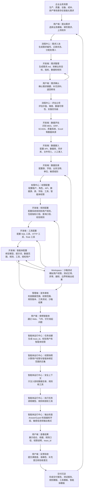

# 电子信息制造业企业智能化项目核心功能流程图 v2

> 说明：本流程图用于展示系统核心功能闭环。所有连线均为实线箭头，不使用虚线。

## 流程说明

| 阶段 | 核心功能 | 主要产出 |
| --- | --- | --- |
| 需求阶段 | 用户提需求、流程入池、开发端整理、用户确认 | 原始需求、需求.md、确认后的需求摘要 |
| 评估阶段 | 价值评估、难度评估、数据可得性评估 | 立项结果、实施任务 |
| 数据阶段 | 数据评估、数据接入、数据目录、字段注释 | 数据源配置、数据目录、字段敏感级别 |
| 权限阶段 | 租户、角色、API、数据、字段、工具、智能体授权 | 有效权限、权限预览、权限审计 |
| 能力配置阶段 | 规则、工具、智能体配置 | 规则版本、工具版本、智能体版本 |
| 测试发布阶段 | Workspace 沙箱测试、发布审核 | 测试报告、发布记录 |
| 运行阶段 | 用户提问、权限快照、安全上下文、模型和工具调用、输出检查 | 智能体回答、trace_id、运行审计 |
| 反馈沉淀阶段 | 用户反馈、验收、交付报告、模板沉淀 | 交付报告、可复用规则/工具/智能体模板 |

