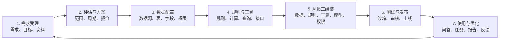

# 电子信息制造业 AI 员工数智化平台建设方案 v1.0

> 方案定位：面向客户汇报和项目介绍，重点说明整体流程、系统功能亮点、核心优势及后续扩展计划。

## 1. 项目概述

电子信息制造业企业已经积累了大量业务数据，但数据通常分散在不同系统中，字段含义、统计口径和访问权限也不统一。业务人员获取数据、制作报表和分析问题仍然依赖人工，企业已有数据和业务经验没有被充分利用。

本项目拟建设一套 AI 员工数智化平台，将企业的数据、业务规则、分析方法和工作流程转化为可配置的 AI 员工能力。

平台最终向客户提供两种使用形式：

| 使用形式 | 主要作用 |
| --- | --- |
| Web 应用系统 | 承载需求、进度、配置、看板、报告和管理功能 |
| AI 员工 | 通过问答、任务、分析、报告和提醒辅助用户开展工作 |

AI 员工不是简单的聊天机器人，而是由授权数据、业务规则、工具、模型、输出方式和权限共同组成的数字化岗位能力。

## 2. 整体建设思路

平台采用“一套平台、两个端、三类支撑能力、多个使用入口”的总体结构。

| 组成 | 主要内容 |
| --- | --- |
| 一套平台 | 统一建设和运营企业 AI 员工 |
| 客户用户端 | 提交需求、查看进度、使用 AI 员工、查看结果和反馈 |
| 开发交付端 | 评估需求、配置数据和规则、组装 AI 员工、测试及发布 |
| 基础运行与治理 | 用户、角色、权限、流程、配置、发布和审计 |
| 数据中心 | 数据接入、表字段管理、业务目录、数据映射和数据权限 |
| AI 员工开发运行中心 | 规则、工具、AI 员工配置、测试、发布和任务运行 |
| 多个入口 | 支持 Web，并逐步扩展到钉钉、飞书和企业微信 |

平台的核心原则是：

```text
模块通用化、业务配置化、能力组件化、资产版本化、运行可审计。
```

## 3. 项目整体流程

项目从客户提出需求开始，到 AI 员工上线使用并持续优化，共分为七个环节。



### 3.1 需求受理

客户通过表单、附件或业务模板提出需求，说明希望解决的问题、使用对象和预期结果。平台统一记录需求和项目进度。

### 3.2 评估与方案

项目团队评估业务范围、数据条件、规则复杂度、接口、权限和交付方式，形成初步解决方案、实施周期及报价区间。

### 3.3 数据配置

接入客户数据库、接口或文件，整理表和字段的业务含义，配置数据映射、敏感级别和访问权限，使系统能够正确理解和安全使用客户数据。

### 3.4 规则与工具配置

将企业的指标口径、计算方法、判断条件和处理要求配置为规则，同时配置数据查询、接口调用、报告生成和消息通知等工具。

### 3.5 AI 员工组装

根据客户需求，将数据、规则、工具、模型、输出模板和使用权限组合为 AI 员工。AI 员工的名称、职责和能力由配置决定，不在系统中写死。

### 3.6 测试与发布

在沙箱环境中模拟不同用户，验证正常问题、异常情况和越权问题。测试和审核通过后，AI 员工才能正式发布。

### 3.7 使用与持续优化

授权用户通过 Web 或协同平台使用 AI 员工，系统记录每次运行过程。用户反馈可形成新的优化需求，推动规则、数据和 AI 员工版本持续更新。

## 4. 整体流程与功能总览图

下图集中展示项目流程、配置化机制和平台通用功能，可直接用于 PPT 汇报。


## 5. 系统功能亮点

### 5.1 通用模块配置

平台不按照某个具体业务场景开发独立系统，而是提供数据、规则、工具、AI 员工、输出和权限等通用模块。更换业务分类、数据对象和规则后，即可配置新的 AI 员工。

### 5.2 AI 员工灵活组装

AI 员工由多种能力组合形成：

```text
AI员工 = 岗位职责 + 授权数据 + 业务规则 + 执行工具
       + 模型能力 + 输出形式 + 使用权限
```

平台可以配置查询、计算、对比、趋势、异常识别、原因分析、报告生成、监测提醒和流程协同等通用能力。

### 5.3 数据与规则双驱动

AI 员工不会直接使用未经整理的原始数据。平台先明确表字段含义和数据权限，再绑定经过确认的业务规则，使分析结果具有统一口径和数据依据。

### 5.4 全链路权限控制

平台统一管理用户、角色、菜单、API、数据、字段、工具和 AI 员工权限。用户只能使用已发布并授权给自己的 AI 员工，AI 员工也只能访问被允许的数据和工具。

### 5.5 测试、发布与审计

AI 员工上线前必须经过测试和审核。上线后，每次运行都会记录用户、AI 员工版本、数据权限、规则和工具调用，方便问题追踪和结果复核。

### 5.6 模板与资产复用

项目交付过程中形成的需求、数据、规则、工具、AI 员工和测试成果可以沉淀为模板。后续客户可以在模板基础上替换参数和业务配置，减少重复建设。

### 5.7 多入口统一使用

平台首先提供 Web 使用端，后续可以接入钉钉、飞书和企业微信。不同入口共享同一套用户、权限、规则和运行能力，避免重复开发业务逻辑。

## 6. 核心功能优势

| 核心优势 | 具体体现 | 为客户带来的价值 |
| --- | --- | --- |
| 平台通用 | 核心模块不依赖具体业务场景 | 能够适配不同部门和不同客户需求 |
| 配置灵活 | 数据、规则、工具、输出和AI员工均可配置 | 新增业务能力时减少重复开发 |
| 口径统一 | AI员工绑定经过确认的规则版本 | 避免不同人员产生不同分析结果 |
| 权限可控 | 用户权限与AI员工权限共同生效 | 降低越权访问和敏感数据泄露风险 |
| 结果可信 | 输出包含数据期间、规则依据和限制说明 | 关键结果能够解释和复核 |
| 过程可追踪 | 需求、配置、测试、发布和运行全程留痕 | 便于项目管理、问题定位和责任确认 |
| 能力可复用 | 规则、工具、AI员工和交付成果可形成模板 | 缩短后续项目的评估与交付周期 |
| 持续可优化 | 用户反馈推动数据、规则和版本迭代 | AI员工能够随业务变化持续改进 |

## 7. 客户价值

平台建设完成后，可以为客户带来以下价值：

1. 降低业务人员查询数据和制作重复报表的工作量。
2. 将分散的数据和业务口径转化为统一、可复用的企业能力。
3. 将业务骨干的分析方法和管理经验沉淀到规则和模板中。
4. 帮助用户更快发现业务异常、获取分析依据并形成处理建议。
5. 在保证权限和数据安全的前提下，让 AI 真正参与企业业务工作。
6. 建立可持续扩展的 AI 员工平台，避免每个需求都重新开发一套系统。

## 8. 后续扩展计划

平台后续按照“先形成基础闭环，再扩展能力和应用范围”的思路逐步建设。

| 阶段 | 扩展重点 | 主要目标 |
| --- | --- | --- |
| 第一阶段：基础平台 | 用户权限、需求流程、数据接入、规则工具、AI员工配置、Web使用和审计 | 跑通一个完整的AI员工建设与使用闭环 |
| 第二阶段：能力扩展 | 多数据源、更多能力组件、协同平台、定时任务、事件提醒和模板复用 | 支持更多部门和更多业务需求 |
| 第三阶段：智能增强 | 企业知识库、知识与数据联合分析、模型评测和主动运营 | 提升AI员工回答质量和主动服务能力 |
| 第四阶段：协同运营 | 多AI员工协作、复杂流程编排、模板市场和运营分析 | 形成企业级AI员工协作与持续运营体系 |

后续可以重点扩展以下方向：

- 增加数据库、API、文件和企业系统适配能力。
- 增加行级权限、动态脱敏和更细粒度的数据安全控制。
- 增加知识库、制度、SOP和业务资料的检索引用能力。
- 增加定时分析、异常订阅、自动报告和任务派发能力。
- 增加多 AI 员工协作和复杂业务流程编排能力。
- 建立模型成本、响应质量、使用效果和客户价值分析能力。
- 完善模板市场，使已验证成果能够快速复制和个性化配置。

## 9. 总结

本项目通过一套通用平台，将客户需求、企业数据和业务规则转化为可配置、可授权、可测试、可发布和可审计的 AI 员工。

整个项目形成以下闭环：

```text
客户提出需求
  -> 平台评估并形成方案
  -> 配置数据、规则和工具
  -> 组装并测试AI员工
  -> 发布给授权用户使用
  -> 根据运行结果和反馈持续优化
```

项目的核心价值不是建设一个通用聊天入口，而是建立一套能够不断配置新 AI 员工、沉淀企业能力并持续产生业务价值的数智化平台。
